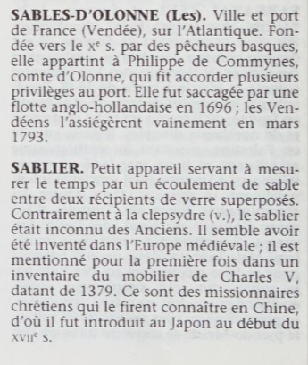

Yacine m'a posé une question intéressante : est-ce qu'un *Petit Mourre : Dictionnaire encyclopédique d'histoire* est un ouvrage pertinent ? Ce document de type tertiaire est volumineux et il a presque complètement disparu des étagères des bibliothèques universitaires. L'information qu'on y trouve est très synthétique et factuelle. Elle est complètement redondante avec ce que l'on peut trouver en ligne. On pense aux pages Wikipédia par exemple.

En y réfléchissant un peu plus, je me suis aperçu qu'on avait dans ce type d'information une chose précieuse : une sorte de consensus de la culture générale minimale à avoir sur un point particulier. Autrement dit, que serait le **minimum de choses** **à savoir** sur un sujet particulier pour lequel on s'attendrait que ceux qui le découvrent sachent ?

[Simple Wikipédia](https://simple.wikipedia.org/wiki/Main_Page) remplit partiellement ce besoin en fournissant une explication simple et plus concise sur des sujets mais : c'est en anglais seulement et c'est encore potentiellement très long.

De manière plus générale, Wikipédia remplit cette fonction sociale de description des choses à savoir sur un sujet, mais les pages sont souvent très longues. Habituellement, le minimum de choses à savoir se trouve dans le premier paragraphe de chaque article, mais cette bonne pratique n'est pas systématique.

Il est aussi possible que les utilisateurs se tournent maintenant vers les outils conversationnels basés sur les LLMs (ChatGPT et cie) pour justement obtenir rapidement cette information minimale par rapport à un sujet.

Bref, compte-tenu de l'évolution du besoin d'information de notre société, je pense que je n'élaguerai pas ce type de document en bibliothèque de recherche. Mais, pour faire de la place sur les rayons, je l'enverrai dans un centre de conservation (une sorte d'entrepôt accessible seulement aux employés et pour lequel il faut faire une demande d'accès auprès de la bibliothèque). Je pense que ce type de document a encore sa place en bibliothèques publiques.
