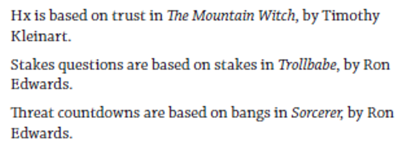
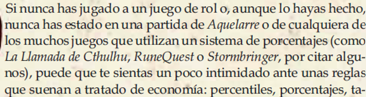



En lisant le message de [Dr. Emily Friedman](https://bsky.app/profile/friede.bsky.social/post/3mchl3jt72c2r) sur Bluesky, je me suis souvenu que j'avais des données de recherche sous le coude. Comme j'avais sous-estimé leur intérêt, je ne les avais jamais versé en ligne. Je vais donc rattraper ce retard et progressivement indexer les données dans Wikidata dans les prochains mois.

## Bibliographie ou pas

Je vais indiquer si tel jeu ou telle édition de jeu possède :

-   une **bibliographie** : une liste simple d'oeuvres ;

-   ou une **bibliographie annotée** : une énumération commentée d'oeuvres, sous la forme de liste ou sous la forme de paragraphes rédigés. En effet, elle peut être présentée sous la forme de paragraphes qui se suivent avec un jeu par paragraphes ou par phrases de manière consécutive. Chaque jeu mentionné doit être accompagné d'un commentaire ou d'une annotation spécifique à celui-ci (le plus souvent pour indiquer son apport au jeu) ;

    {width="500"}

-   ou des **références dans le texte** : des mentions à des oeuvres dans un paragraphe de texte. Ces mentions sont insérées dans le texte pour illustrer le discours ou l'argumentation ou pour donner des exemples. Ces mentions listées ne sont pas commentées systématiquement ou spécifiquement. On peut aussi aussi utiliser ceci dans les cas où seulement quelques oeuvres sont mentionnées ;

    {width="500"}

-   ou des **notes de marge** : des petits blocs de texte présentés en annotation dans les marges. NB : contrairement aux 3 premiers éléments, ces *marginalia* ne contiennent pas forcément des références. ;

-   ou des **notes de bas de page** : des petits blocs de texte présentés en annotation dans le bas des pages. NB : contrairement aux 3 premiers éléments, ces notes de bas de page ne contiennent pas forcément des références. 

#### Indexation

Pour indexer ces éléments, dans Wikidata j'utilise la propriété `uses (P2283)` avec la valeur :

-   *bibliography* [Q1631107](https://www.wikidata.org/wiki/Q1631107)
-   ou *annotated bibliography* [Q4769616](https://www.wikidata.org/wiki/Q4769616)
-   ou *inline reference* [Q137842886](https://www.wikidata.org/wiki/Q137842886)
-   ou *marginalia* [Q1572441](https://www.wikidata.org/wiki/Q1572441)
-   ou *footnote* [Q25424643](https://www.wikidata.org/wiki/Q25424643)

Ensuite, dans les *qualifiers*, je rajoute le nombre d'oeuvres présentes avec la propriété `Number of records (P4876)`. Dans le cas où j'ai listé plusieurs types de bibliographie, ce nombre compte le nombre spécifique de référence de chaque type (ex: bibliography = 12; inline = 5). Dans le cas où j'ai fait une généralité, ce nombre reflète le total (ex: bibliography = 12+5 = 17).

Enfin, j'utilise aussi `Page(s) (P304)` dans *References* pour indiquer la page ou l'intervalle de page où se trouve la bibliographie dans le jeu.

Je n'ai pas (encore) trouvé comment indiquer élégamment qu'un jeu ne possède pas de bibliographie.

#### Exemples d'indexations

-   [*10.000*](https://www.wikidata.org/wiki/Q68028056)
-   [*7th Sea (1st edition)*](https://www.wikidata.org/wiki/Q110883344)
-   [*Against the Darkmaster*](https://www.wikidata.org/wiki/Q106036541)

#### SPARQL

Voici la requête pour afficher toutes les données :

``` sql

SELECT ?item ?itemLabel ?usesLabel ?NbOfRecords ?AtPages WHERE {
  # items is a TTRPG or a TTRPG supplement
  VALUES ?TTRPGset {wd:Q1643932 wd:Q71631512}
  ?item wdt:P31 ?TTRPGset.

  # Find items where P2283 (uses) is either bibliography or annotated bib. or inline ref. or marginalia or footnote
  ?item p:P2283 ?statement.
  ?statement ps:P2283 ?uses.
  FILTER(?uses IN (wd:Q4769616, wd:Q1631107, wd:Q137842886, wd:Q1572441 , wd:Q25424643))
  
  # Optional: Get qualifier P4876 (number of records)
  OPTIONAL { ?statement pq:P4876 ?NbOfRecords. }
  
  # Optional: Get reference P304 (page(s))
  OPTIONAL {
    ?statement prov:wasDerivedFrom ?reference.
    ?reference pr:P304 ?AtPages.
  }
  
  # Get labels for display
  SERVICE wikibase:label { bd:serviceParam wikibase:language "[AUTO_LANGUAGE],en". }
}
```

[Essayez-la](https://query.wikidata.org/#SELECT%20%3Fitem%20%3FitemLabel%20%3FusesLabel%20%3FNbOfRecords%20%3FAtPages%20WHERE%20%7B%0A%20%20%23%20items%20is%20a%20TTRPG%20or%20a%20TTRPG%20supplement%0A%20%20VALUES%20%3FTTRPGset%20%7Bwd%3AQ1643932%20wd%3AQ71631512%7D%0A%20%20%3Fitem%20wdt%3AP31%20%3FTTRPGset.%0A%0A%20%20%23%20Find%20items%20where%20P2283%20%28uses%29%20is%20either%20bibliography%20or%20annotated%20bib.%20or%20inline%20ref.%20or%20marginalia%20or%20footnote%0A%20%20%3Fitem%20p%3AP2283%20%3Fstatement.%0A%20%20%3Fstatement%20ps%3AP2283%20%3Fuses.%0A%20%20FILTER%28%3Fuses%20IN%20%28wd%3AQ4769616%2C%20wd%3AQ1631107%2C%20wd%3AQ137842886%2C%20wd%3AQ1572441%20%2C%20wd%3AQ25424643%29%29%0A%20%20%0A%20%20%23%20Optional%3A%20Get%20qualifier%20P4876%20%28number%20of%20records%29%0A%20%20OPTIONAL%20%7B%20%3Fstatement%20pq%3AP4876%20%3FNbOfRecords.%20%7D%0A%20%20%0A%20%20%23%20Optional%3A%20Get%20reference%20P304%20%28page%28s%29%29%0A%20%20OPTIONAL%20%7B%0A%20%20%20%20%3Fstatement%20prov%3AwasDerivedFrom%20%3Freference.%0A%20%20%20%20%3Freference%20pr%3AP304%20%3FAtPages.%0A%20%20%7D%0A%20%20%0A%20%20%23%20Get%20labels%20for%20display%0A%20%20SERVICE%20wikibase%3Alabel%20%7B%20bd%3AserviceParam%20wikibase%3Alanguage%20%22%5BAUTO_LANGUAGE%5D%2Cen%22.%20%7D%0A%7D)

## Points notables

Le jeu le plus remarquable pour son énorme bibliographie annotée est [*A Game of Thrones d20*](https://www.wikidata.org/wiki/Q677281) (2005) qui contient un essai complet sur la fantasy avec 379 références à l'intérieur du livre de règles (pp. 21-35).

Le plus ancien jeu avec des références dans le texte est *D&D* (1974), avec une attribution *médiocrement* reconnaissante envers la campagne de [Blackmoor](https://jdr.hypotheses.org/1434) de Dave Arneson, matrice du game design des jeux de rôle sur table tels que nous les connaissons aujourd'hui.

Rapidement, les premiers jeux tels que *Tunnels & Trolls* ou *RuneQuest* ont cité *D&D* avant d'arrêter. Voir mon billet sur les *Ceases & Desists* (en [français](https://jdr.hypotheses.org/1199), in [English](http://zotrpg.blogspot.com/2020/08/cease-desist-orders-and-citation.html)) sur le sujet.

Le jeu le plus ancien avec une bibliographie est \[à déterminer\]. Le jeu le plus ancien avec une bibliographie annotée est \[à déterminer\].

## Épigraphes

J'avais commencé à indexer la présence d'épigraphes dans les jeux de rôle sur table.

J'avais aussi utilisé la propriété `uses` avec comme valeur :

-   *epigraph* [(Q669777](https://www.wikidata.org/wiki/Q669777)) avec comme qualifiers :

    -   *quantity* (P1117)

    -   *has characteristic* (P1552) = *referenced value* ([Q71536081](https://www.wikidata.org/wiki/Q71536081))

-   *fictional quotation* ([Q18011336](https://www.wikidata.org/wiki/Q18011336))

    -   *quantity* (P1117)

    -   *has characteristic* (P1552) = *in-universe perspective* ([Q96102813](https://www.wikidata.org/wiki/Q96102813))

#### Exemple

-   [7th Sea (1st edition)](https://www.wikidata.org/wiki/Q110883344)

#### Requête pour afficher l'indexation des épigraphes

``` sql

SELECT ?epigraph ?epigraphLabel ?usesLabel ?quantity WHERE {
  # items is a TTRPG 
  ?epigraph wdt:P31 wd:Q1643932.
  # Find items where P2283 (uses) is either Q669777 (epigraph) or Q18011336 (fictional quotation)
  ?epigraph p:P2283 ?statement.
  ?statement ps:P2283 ?uses.
  FILTER(?uses IN (wd:Q669777, wd:Q18011336))
  
  # Optional: Get qualifier P1114 (quantity)
  OPTIONAL { ?statement pq:P1114 ?quantity. }
  
  # Get labels for display
  SERVICE wikibase:label { bd:serviceParam wikibase:language "[AUTO_LANGUAGE],en". }
}
```

[Essayez-la](https://query.wikidata.org/#SELECT%20%3Fepigraph%20%3FepigraphLabel%20%3FusesLabel%20%3Fquantity%20WHERE%20%7B%0A%20%20%23%20items%20is%20a%20TTRPG%20%0A%20%20%3Fepigraph%20wdt%3AP31%20wd%3AQ1643932.%0A%20%20%23%20Find%20items%20where%20P2283%20%28uses%29%20is%20either%20Q669777%20%28epigraph%29%20or%20Q18011336%20%28fictional%20quotation%29%0A%20%20%3Fepigraph%20p%3AP2283%20%3Fstatement.%0A%20%20%3Fstatement%20ps%3AP2283%20%3Fuses.%0A%20%20FILTER%28%3Fuses%20IN%20%28wd%3AQ669777%2C%20wd%3AQ18011336%29%29%0A%20%20%0A%20%20%23%20Optional%3A%20Get%20qualifier%20P1114%20%28quantity%29%0A%20%20OPTIONAL%20%7B%20%3Fstatement%20pq%3AP1114%20%3Fquantity.%20%7D%0A%20%20%0A%20%20%23%20Get%20labels%20for%20display%0A%20%20SERVICE%20wikibase%3Alabel%20%7B%20bd%3AserviceParam%20wikibase%3Alanguage%20%22%5BAUTO_LANGUAGE%5D%2Cen%22.%20%7D%0A%7D)

```{=html}
<!-- Pour intégrer le post Bluesky, je suis allé dans le terminal du projet Quarto et j'ai lancé : 

quarto install extension sellorm/quarto-social-embeds

source : https://quarto-social-embeds.sellorm.com/ -->
```
