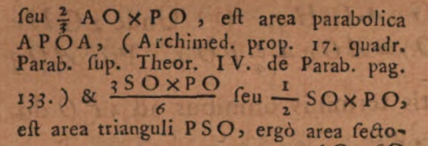

[Billet en cours de rédaction]{.smallcaps}

## *Principia Mathematica*, c'est quoi ?

*Philosophiæ Naturalis Principia Mathematica*^Q^ de Isaac Newton (1687) est une oeuvre majeure dans l'histoire des sciences. Avant de commencer ce projet, je sais que les lois mathématiques présentées dans ce texte permettent de décrire le monde physique, en particulier le mouvement des corps célestes et la gravitation. Par ailleurs, je me souviens que Newton y élabore sa propre méthode de calcul infinitésimal (comprenant dérivés et intégrales), en rivalité avec Leibniz pour la primauté de cette découverte. Je n'en sais pas plus et je vais découvrir le sujet au fur et à mesure.

[{fig-alt="Page de garde des Principia Mathematica"}](https://umontreal.on.worldcat.org/oclc/869576311)

## Pratiques de citation

*Principia* est un objet littéraire et scientifique idéal pour étudier les pratiques de citation que l'on y trouve car 1) on peut observer comment Newton cite ceux qui l'on précédé et tenter d'expliquer pourquoi; et 2) cette oeuvre a été lue et étudiée par un très grand nombre de scientifiques dans les siècles qui ont suivi (impact).

Je me sers de cette étude descriptive comme exercice de méthodologie pour le décorticage d'une oeuvre littéraire et de ses pratiques de citation. Le but est de dégager des bonnes pratiques, des questions, des enjeux, des découvertes, etc.

## Méthode 1 : annotation manuelle

J'ai parcouru visuellement tout le livre pour repérer des indications d'attribution, de citations, de mentions, etc.

J'ai trouvé principalement :

-   Beaucoup de mentions de personnes (entités nommées d'individus) et un peu d'institutions ou de groupes. Ils ont été indexé au fil de l'eau dans Wikidata avec la propriété [acknowledged (P7137)](https://www.wikidata.org/wiki/Property:P7137) et avec le qualifiant [object named as (P1932)](https://www.wikidata.org/wiki/Property:P1932) pour décrire la ou les formes que le nom prend dans le texte.

-   Un peu de mentions de travaux. Ils ont été indexé au fil de l'eau dans Wikidata avec la propriété [cites work (P2860)](https://www.wikidata.org/wiki/Property:P2860) et avec le qualifiant [object named as (P1932)](https://www.wikidata.org/wiki/Property:P1932) pour décrire comment l'oeuvre est décrite dans le texte.

### Inconvénients

Si on veut calculer qui est cité et combien de fois et où, il faut extraire toutes ces mentions et créer un script qui les compte. Et encore, certains termes trop génériques risquent de générer des faux-positifs (exemple : *Conics*). Idéalement, il aurait fallu créer un fichier XML-TEI et le baliser.

### Avantages

Cela permet de parcourir tout le document et de découvrir progressivement des tendances et se faire une culture personnelle des éléments mentionnés. Par exemple, le repérage d'astronomes du XVIIe a été un vrai défi pour repérer qui pouvait être tel ou tel personnage cité.

Plusieurs fois, il m'a fallu créer de nouveaux éléments Wikidata pour des entités (personnes ou travaux) qui n'existaient pas encore dans Wikidata :

-   Legum Allegoriæ (Q138348789)
-   Valentinus Estancius (Q138341375)
-   Ponthæus (Q138341287)
-   Samuel Colepress (Q138334903)
-   Varin (Q138334135)
-   Institutionum astronomicarum (Q138332932)
-   Conics (Q138296602)
-   The two Books of Apollonius Pergaeus... (Q138296556)
-   Ephemerides novae motuum coelestium (Q138354676)
-   De Lucis natura et proprietate (Q138568343)

On découvre et on mémorise naturellement des tendances. Par exemple :

-   Les personnes sont souvent citées en série ;
-   Les personnes sont soient des observateurs, soient des théoriciens (math, physique, etc.) ;
-   Les personnes sont souvent citées au début ou à la fin pour leurs théories ;
-   Les italiques sont parfois utilisées pour les personnes et les oeuvres ;
-   Les noms des personnes sont très succincts, voire ne correspondent pas à la forme « canonique » de leur nom tels que nous les connaissons aujourd'hui : espaces dans le nom, double L ou simple L, nom latin ou nom vulgaire, parfois nommé d'une manièr et parfois d'une autre, etc. ;
-   Galilée, dont les *Principia* prolongent les travaux, n'est pas beaucoup cité ;
-   Il y a une section de citations bibliques ;

## Méthode 2 : traitement automatisé

### AstaLab AutoDiscovery

J'ai testé *AstaLab AutoDiscovery* (AA) qui est censé être un «générateur d'hypothèses». J'ai téléchargé le texte complet des Principia depuis WikiSource au format Plain Text. Je l'ai soumis à AA en demandant 10 hypothèses. Ce n'était pas fameux mais la seule hypothèse intéressante était celle concernant les entités nommées citées. Voici ce qu'il dit :

> The citations of historical scientific authorities (e.g., Kepler, Galileo, Euclid, Descartes) are not uniformly distributed but appear in distinct bursts, suggesting that Newton engages with specific intellectual lineages in concentrated thematic blocks rather than continuously. ([source](https://autodiscovery.allen.ai/runs/2b2c27fe-d02c-4f3e-9cc7-b8557a2cd781?exp=2))

De manière plus intéressante encore, AA fournit le code Python pour produire cette déclaration. Le voici :

``` python

import numpy as np
import matplotlib.pyplot as plt
import re
import os
from scipy.stats import kstest
from collections import Counter

# Define the target names of historical scientists
# Using a predefined list as suggested to avoid NER model dependency issues
target_names = [
    "Kepler", "Galileo", "Euclid", "Descartes", "Copernicus", 
    "Tycho", "Brahe", "Huygens", "Hooke", "Halley", "Boyle", 
    "Archimedes", "Apollonius", "Wren", "Wallis", "Leibniz", "Newton"
]

# File path setup
filename = "The_Mathematical_Principles_of_Natural_Philosophy_(1846).txt"
filepath = os.path.join("..", filename)

# Check if file exists in parent dir, otherwise check current dir
if not os.path.exists(filepath):
    filepath = filename
    if not os.path.exists(filepath):
        print(f"Error: File {filename} not found in .. or current directory.")
        exit(1)

print(f"Loading dataset from: {filepath}")

with open(filepath, 'r', encoding='utf-8', errors='ignore') as f:
    text = f.read()

# 1. Identify locations of names
print("Identifying name occurrences...")
# Use regex with word boundaries for robustness
pattern = r'\b(' + '|'.join(target_names) + r')\b'
matches = list(re.finditer(pattern, text, re.IGNORECASE))

occurrences = []
found_names = []

for match in matches:
    occurrences.append(match.start())
    # Normalize name to Title Case for counting
    found_names.append(match.group(1).title())

if not occurrences:
    print("No target names found in the text.")
    exit()

# Convert to numpy array
positions = np.array(occurrences)
total_length = len(text)

# 2. Time-series-like array (positions are the events)
# Normalize positions to [0, 1] for KS test against uniform distribution
normalized_positions = positions / total_length

# 3. Kolmogorov-Smirnov Test
# Test if the observed normalized positions follow a uniform distribution [0, 1]
stat, p_value = kstest(normalized_positions, 'uniform')

# 4. Dispersion Index of distances
# Calculate distances (inter-arrival times) between consecutive names
intervals = np.diff(positions)
if len(intervals) > 0:
    mean_interval = np.mean(intervals)
    var_interval = np.var(intervals, ddof=1)
    # The user requested variance/mean of the distances
    dispersion_metric = var_interval / mean_interval
    
    # Also calculating Coefficient of Variation (CV) which is dimensionless
    cv = np.std(intervals, ddof=1) / mean_interval
else:
    mean_interval = 0
    var_interval = 0
    dispersion_metric = 0
    cv = 0

# Generate Summary
counts = Counter(found_names)

print("\n##### Analysis Results #####")
print(f"Total Citations Found: {len(positions)}")
print(f"Unique Scientists Cited: {len(counts)}")
print("\nTop 10 Most Cited Scientists:")
for name, count in counts.most_common(10):
    print(f"  {name}: {count}")

print("\n##### Statistical Test Results #####")
print(f"KS Test Statistic: {stat:.4f}")
print(f"KS Test p-value: {p_value:.4e}")
if p_value < 0.05:
    print("Result: The distribution of names is significantly different from Uniform (p < 0.05).")
else:
    print("Result: The distribution is consistent with Uniform.")

print(f"\nMean Distance between citations: {mean_interval:.2f} characters")
print(f"Variance of Distances: {var_interval:.2f}")
print(f"Dispersion Metric (Var/Mean of distances): {dispersion_metric:.2f}")
print(f"Coefficient of Variation (Std/Mean): {cv:.2f}")
if cv > 1:
    print("Interpretation: CV > 1 suggests clustering/burstiness.")
elif cv < 1:
    print("Interpretation: CV < 1 suggests regularity.")
else:
    print("Interpretation: CV ~ 1 suggests random Poisson process.")

# Visualizations
plt.figure(figsize=(15, 6))

# Subplot 1: Rug Plot
plt.subplot(1, 2, 1)
plt.eventplot(positions, orientation='horizontal', colors='black', linewidths=0.5)
plt.title("Rug Plot of Scientific Authority Citations")
plt.xlabel("Position in Text (Characters)")
plt.yticks([])
plt.xlim(0, total_length)

# Subplot 2: Histogram
plt.subplot(1, 2, 2)
plt.hist(positions, bins=50, color='skyblue', edgecolor='black', alpha=0.7)
plt.title("Histogram of Citation Density")
plt.xlabel("Position in Text (Characters)")
plt.ylabel("Frequency")

plt.tight_layout()
plt.show()
```

C'est un code rudimentaire mais il permet de jouer un peu avec le corpus. Comme on peut le voir, il suffit de changer le contenu de la variable `target_names` avec tous les noms que l'on veut pour regénérer un nouveau résultat testant la présence d'entités nommées tout le long du texte.

### Extraire les noms de Wikidata

On va extraire tous les qualifiants de `acknowledges` avec :

``` sql

SELECT ?value ?valueLabel ?qualifierValue
WHERE {
  wd:Q205921 p:P7137 ?statement .
  ?statement ps:P7137 ?value .
  
  OPTIONAL {
    ?statement pq:P1932 ?qualifierValue .
  }
  
  SERVICE wikibase:label {
    bd:serviceParam wikibase:language "en".
  }
}
```

[Essayez-la](https://query.wikidata.org/#SELECT%20%3Fvalue%20%3FvalueLabel%20%3FqualifierValue%0AWHERE%20%7B%0A%20%20wd%3AQ205921%20p%3AP7137%20%3Fstatement%20.%0A%20%20%3Fstatement%20ps%3AP7137%20%3Fvalue%20.%0A%20%20%0A%20%20OPTIONAL%20%7B%0A%20%20%20%20%3Fstatement%20pq%3AP1932%20%3FqualifierValue%20.%0A%20%20%7D%0A%20%20%0A%20%20SERVICE%20wikibase%3Alabel%20%7B%0A%20%20%20%20bd%3AserviceParam%20wikibase%3Alanguage%20%22en%22.%0A%20%20%7D%0A%7D)

Ensuite, on exporte le résultat au format tsv ou csv, on supprime les deux premières colonnes pour ne garder que la colonne `qualifierValue`. On fait un peu de ménage dedans :

-   sans `Mr.` ou `Dr.` ou `M.`
-   sans initiales, ni extensions du nom (`Pappus of Alexandria` devient `Pappus`)
-   supprimer les troncatures emboîtées pour éviter les doubles comptages (ex: pour `Samuel Colepress` et `Colepress` : ne garder que `Colepress`)

Cela donne [names.csv](names.csv)

### Code modifié

Remplacer la variable `target_names` plus haut par :

``` python

target_names = [
"Horrox", "Egyptians", "Romans", "Anaximander", "Pythagoreans", "Pompilius", "Democritus", "Eudoxus", "Calippus", "Crabtrie", "Marius", "Townley", "Romer", "Ricciolus", "Kircher", "Pappus", "Halley", "Royal Society", "Galileo", "Wren", "Wallis", "Huygens", "Huygenian", "Hugenius", "Mariotte", "Euclid", "Hook", "Hooke", "Apollonius", "Archimedes", "Snellius", "Des Cartes", "Grimaldus", "Collins", "Slusius", "Huddens", "Desaguliers", "Sauveur", "Copernicus", "Copernican", "Borelli", "Townly", "Cassini", "Pound", "Kepler", "Keplerian", "Bullialdus", "Ptolemy", "Vendelin", "Street", "Tycho", "Mercator", "Norwood", "Picart", "Richer", "Varin", "des Hayes", "Couplet", "Feuillé", "de la Hire", "Colepress", "Sturmy", "Machin", "Pemberton", "Flamsted", "Hevelius", "Cysatus", "Bayer", "Kirch", "Julius Cæsar", "Ponthæus", "Cellius", "Galletius", "Ango", "Storer", "Montenari", "Zimmerman", "Estancius", "Simeon", "Matthew Paris", "Aristotle", "Auzout", "Petit", "Gottignies", "Bradley", "Hipparchus", "Cornelius Gemma", "God", "Pocock", "John", "Moses", "Aaron", "Pythagoras", "Cicer.", "Thales", "Anaxagoros", "Virgil", "Aratus", "St. Paul", "David", "Solomon", "Job", "Jeremiah", "Pharaoh", "Philolaus", "Aristarchus", "Plato", "Leibnitz",
]
```

Voir le [code](https://pmartinolli.github.io/code/principia-mathematica/main.py) modifié et le [corpus](https://pmartinolli.github.io/code/principia-mathematica/corpus.txt) associé.

### Contrôle (manuel)

Avec un éditeur de texte comme Notepad++, utiliser quelques noms pour compter manuellement quelques entités nommées dans le corpus (Fonction Rechercher + Compter) et ainsi vérifier que le code fonctionne et compte bien les choses.

### Résultats

``` texinfo
##### Analysis Results #####
Total Named Entities Found: 433
Unique Named Entities Mentioned: 105

Top 10 Most Mentioned Named Entities:
  God: 32
  Halley: 24
  Flamsted: 24
  Hevelius: 21
  Hook: 19
  Kepler: 19
  Huygens: 16
  Montenari: 15
  Cassini: 12
  Galileo: 11

##### Statistical Test Results #####
KS Test Statistic: 0.4501
KS Test p-value: 1.4120e-80
Result: The distribution of names is significantly different from Uniform (p < 0.05).

Mean Distance between Mentions: 3023.94 characters
Variance of Distances: 96545741.47
Dispersion Metric (Var/Mean of distances): 31927.11
Coefficient of Variation (Std/Mean): 3.25
Interpretation: CV > 1 suggests clustering/burstiness.
```


## Et maintenant ?

#### *Keyword in Context*

On pourrait créer un nouveau code pour générer un index avec tous les mots-clés cherchés en contexte (*Keyword in Context* ou *KWIC*) et ainsi comprendre comment ils sont utilisés dans le texte.

On peut y ajouter un graphique qui indique à quel endroit est-ce que les mots sont repérés.

Voici un premier [code](#0) et son [résultat](#0).

#### Pourquoi faire ça ?

1.  Pour agir comme **contrôle** du traitement du corpus et vérifier que tout à bien été repéré. En effet, certaines entités nommées peuvent avoir été oubliées lors du traitement manuel et. comme les entitées nommées sont souvent menrionnées à côté d'autres entités nommées, cela peut aider à repérer des manquants.
2.  Mieux **repérer les oeuvres citées**. En effet, dans l'immense majorité des cas, le titre d'une oeuvre est accompagnée de son auteur (avant ou après le titre).
3.  Pour comprendre comment les entités nommées sont **utilisées** :
    1.  on mentionne une personne pour ses idées (découvertes, équations, théories, etc.) ou pour ses observations astronomiques ?
    2.  En début ou en fin de corpus ?
    3.  Autres.

#### Remontons aux sources originales

On pourrait comparer les **différentes éditions** des *Principia* pour observer quelles sont entités nommées qui disparaissent, ou qui apparaissent. Et pourquoi ? Nous avons débuté avec une version anglaise (la première édition américaine), remontons à la version presque-originale en latin : la version génèvoise de Le Seur & Jacquier de 1739.

On passe les PDF des trois volumes à travers le code suivant (qui fait un OCR basé sur Tesseract) :

``` python
# -*- coding: utf-8 -*-
"""
Created on Thu Nov 27 21:49:37 2025

@author: pascaliensis, with Claude Sonnet 4.2
"""

# pip install ocrmypdf
# pip install ghostscript

import ocrmypdf
import tempfile
import os
import shutil
from pathlib import Path
import pytesseract
import ghostscript


def check_dependencies():
    """Check if required dependencies are installed."""
    missing = []
    
    # Check Tesseract
    if not shutil.which('pytesseract'):
        missing.append('Tesseract OCR')
    
    # Check Ghostscript (gs on Linux/Mac, gswin64c or gswin32c on Windows)
    gs_names = ['gs', 'gswin64c', 'gswin32c']
    if not any(shutil.which(gs) for gs in gs_names):
        missing.append('Ghostscript')
    
    if missing:
        deps_str = ' and '.join(missing)
        raise Exception(
            f"Missing dependencies: {deps_str}\n\n"
            f"Installation instructions:\n"
            f"- Ghostscript: https://ghostscript.com/releases/gsdnld.html\n"
            f"- Tesseract: https://github.com/UB-Mannheim/tesseract/wiki\n"
            f"After installation, restart your Python environment."
        )


def process_pdf_with_ocr(input_pdf_path, output_pdf_path=None, language='lat', 
                         deskew=True, remove_background=False, 
                         force_ocr=False, skip_text=False, redo_ocr=False,
                         check_deps=True, **kwargs):
    """
    Process a PDF with OCRmyPDF to add an OCR text layer.
    
    Parameters:
    -----------
    input_pdf_path : str or Path
        Path to the input PDF file
    output_pdf_path : str or Path, optional
        Path for the output PDF. If None, creates a temporary file
    language : str, default='eng'
        OCR language code (e.g., 'eng', 'fra', 'spa', 'deu')
    deskew : bool, default=True
        Whether to deskew crooked pages
    remove_background : bool, default=False
        Whether to remove background from pages
    force_ocr : bool, default=False
        Force OCR even if PDF already has text (keeps existing text + OCR)
    skip_text : bool, default=False
        Skip OCR on pages that already have text
    redo_ocr : bool, default=False
        Remove existing text and redo OCR from scratch
    check_deps : bool, default=True
        Whether to check for dependencies before processing
    **kwargs : dict
        Additional OCRmyPDF parameters
        
    Returns:
    --------
    str : Path to the output PDF file
    
    Notes:
    ------
    - force_ocr: Use for scanned PDFs incorrectly marked as having text
    - skip_text: Use to only OCR image-only pages in mixed PDFs  
    - redo_ocr: Use to replace poor quality existing text with new OCR
    
    Example:
    --------
    >>> # For a scanned PDF marked as Tagged PDF
    >>> output = process_pdf_with_ocr('input.pdf', 'output.pdf', force_ocr=True)
    >>> print(f"OCR processed PDF saved to: {output}")
    """
    
    # Check dependencies first
    if check_deps:
        check_dependencies()
    
    # Convert input path to Path object
    input_path = Path(input_pdf_path)
    
    # Validate input file exists
    if not input_path.exists():
        raise FileNotFoundError(f"Input PDF not found: {input_pdf_path}")
    
    # Handle output path
    if output_pdf_path is None:
        # Create temporary file if no output path specified
        temp_file = tempfile.NamedTemporaryFile(delete=False, suffix='.pdf')
        output_path = temp_file.name
        temp_file.close()
    else:
        output_path = str(output_pdf_path)
    
    try:
        # Run OCRmyPDF
        ocrmypdf.ocr(
            input_path,
            output_path,
            language=language,
            deskew=deskew,
            remove_background=remove_background,
            force_ocr=force_ocr,
            skip_text=skip_text,
            redo_ocr=redo_ocr,
            **kwargs
        )
        
        print(f"✓ OCR processing complete: {output_path}")
        return output_path
        
    except ocrmypdf.exceptions.PriorOcrFoundError:
        print("⚠ PDF already contains OCR text layer")
        return str(input_path)
    
    except ocrmypdf.exceptions.MissingDependencyError as e:
        # Clean up temp file if created
        if output_pdf_path is None and os.path.exists(output_path):
            os.unlink(output_path)
        
        error_msg = str(e)
        if 'ghostscript' in error_msg.lower() or 'gs' in error_msg.lower():
            raise Exception(
                "Ghostscript not found!\n\n"
                "Install from: https://ghostscript.com/releases/gsdnld.html\n"
                "After installation, restart your Python environment."
            )
        elif 'tesseract' in error_msg.lower():
            raise Exception(
                "Tesseract OCR not found!\n\n"
                "Install from: https://github.com/UB-Mannheim/tesseract/wiki\n"
                "After installation, restart your Python environment."
            )
        else:
            raise Exception(f"Missing dependency: {error_msg}")
        
    except Exception as e:
        # Clean up temp file if created and error occurred
        if output_pdf_path is None and os.path.exists(output_path):
            os.unlink(output_path)
        raise Exception(f"OCR processing failed: {str(e)}")


# Example usage
if __name__ == "__main__":
    # For a scanned PDF that's marked as Tagged PDF (your case)
    output = process_pdf_with_ocr(
        'corpus-latin.pdf', 
        #'output_with_ocr2.pdf',
        language='lat',  # French language (based on filename)
        deskew=True,
        rotate_pages=True,
        #remove_background=True,
        optimize=1,  # PDF optimization level (0-3)
        force_ocr=True,  # Force OCR even though it's marked as Tagged PDF
    )
```

Ensuite, on y cherche les entités nommées à partir de l'indexation Wikidata faite sur la version en anglais. C'est un peu plus facile de trouver les entités nommées comme ceci car elles « sautent plus aux yeux » en anglais qu'en latin (pour moi qui ait oublié mon latin depuis 35 ans). Notons cependant que les entitées nommées sont souvent en italiques dans le texte latin, ce qui aide tout de même.

Quelques remarques :

-   Edme Marriote^[Q](https://www.wikidata.org/wiki/Q319749)^ a été mentionné comme *Clarissimus Mariottus* (« très illustre Mariotte ») dans le texte original. Cette reconnaissance a été perdue dans la traduction en anglais.

-   J'étais passé à côté des deux citations abrégées à *La Quadrature de la parabole^[Q](https://www.wikidata.org/wiki/Q3111341)^* de Archimède. {width="263"}\
    Ainsi qu'une référence à *De Lucis natura et proprietate*^[Q](https://www.wikidata.org/wiki/Q138568343)^ de Isaac Vossius.

-   Bonnes pratiques :

    -   dois-je indexer les *f* comme des *s* ? ou conserver la typographie originale ? Choix effectué : indexer comme des *s*.

    -   dois-je indexer toutes les déclinaisons latines trouvées ou seulement la forme nominative ? Choix effectué : presque toutes.

-   Non repérés dans la version latine :

    -   `Slusius` (mal OCRisé + en latin, car rédigé comme `Siufii` au lieu de `Slufii`)

J'interrompt ici le travail pour recomposer les scripts. Il me faut un tableau qui regroupe tous les alias/synonymes et les compte pour un seul. Il faut aussi intervertir les s et les f.

#### Regrouper les aliases de noms

Le code se [trouve ici](https://pmartinolli.github.io/code/principia-mathematica/main-v2-avecAliases.py), le fichier [query.csv](https://pmartinolli.github.io/code/principia-mathematica/query.csv) est issu de la requête SPARQL plus haut.

#### Résultats

``` texinfo
##### Analysis Results #####
Total Named Entity Mentions: 385
Unique Entities Mentioned:   98

Top 10 Most Mentioned Entities (grouped by ID):
  [Q190] God (32x)
  [Q46830] Robert Hooke (26x)
  [Q47434] Edmond Halley (24x)
  [Q57963] Johannes Hevelius (21x)
  [Q8963] Johannes Kepler (20x)
  [Q242388] John Flamsteed (16x)
  [Q39599] Christiaan Huygens (15x)
  [Q14279] Giovanni Domenico Cassini (12x)
  [Q307] Galileo Galilei (11x)
  [Q36620] Tycho Brahe (10x)

##### Statistical Test Results #####
KS Test Statistic: 0.4320
KS Test p-value:   8.3047e-66
Result: Distribution significantly differs from Uniform (p < 0.05).

Mean Distance between Mentions: 3401.93 characters
Variance of Distances:          107880204.92
Dispersion Metric (Var/Mean):   31711.43
Coefficient of Variation:       3.05
Interpretation: CV > 1 → clustering / burstiness.
```

#### En image


Hélas, ce code n'est pas parfait car il compte deux fois les variantes d'un nom.

#### Réécriture du code la localisation unique des noms en html

On localise où se trouve le nom dans le corpus et, en cas de variante, comme `Hooke` et `Dr. Hooke`, on ne compte qu'une fois.

``` python
# -*- coding: utf-8 -*-
# author : pascaliensis with Claude Sonnet 4.6
"""
KWIC (Keywords in Context) Index Generator
Reads corpus.txt and query.csv, then produces a styled HTML index grouped by
canonical entity (Wikidata ID), merging all aliases under the same entry.
Includes a dispersion plot showing where each entity appears in the corpus.
"""

import re
import html
import csv
import os
from collections import defaultdict

# ── Configuration ──────────────────────────────────────────────────────────────
CORPUS_FILE   = "corpus.txt"
CSV_FILE      = "query.csv"
OUTPUT_FILE   = "kwic_index-v2.html"
CONTEXT_WINDOW = 300    # characters on each side of the keyword
CASE_SENSITIVE = True  # set True to match exact case only
# ──────────────────────────────────────────────────────────────────────────────

COLORS = [
    "#c0392b", "#2471a3", "#1e8449", "#d4ac0d",
    "#7d3c98", "#ca6f1e", "#117a65", "#2e4057",
]


# ── Load entity definitions from CSV ─────────────────────────────────────────
def load_entities(csv_path: str) -> tuple[dict, dict, dict]:
    """
    Returns:
        id_to_label   : {entity_id: canonical_label}
        id_to_aliases : {entity_id: [alias, ...]}   (insertion-ordered, no dupes)
        alias_to_id   : {alias: entity_id}
    """
    id_to_label   = {}
    id_to_aliases = defaultdict(list)
    alias_to_id   = {}

    with open(csv_path, newline='', encoding='utf-8') as f:
        for row in csv.DictReader(f):
            eid   = row['value'].strip()
            label = row['valueLabel'].strip()
            alias = row['qualifierValue'].strip()

            id_to_label[eid] = label
            if alias not in id_to_aliases[eid]:   # no duplicate aliases per entity
                id_to_aliases[eid].append(alias)
            alias_to_id[alias] = eid              # last row wins on true collision

    return id_to_label, dict(id_to_aliases), alias_to_id


# ── Corpus loading ────────────────────────────────────────────────────────────
def load_corpus(path: str) -> str:
    with open(path, encoding='utf-8', errors='ignore') as f:
        return f.read()


# ── Find occurrences for all aliases, grouped by entity ID ───────────────────
def find_all_occurrences(
    corpus: str,
    id_to_aliases: dict,
    alias_to_id: dict,
    window: int,
    case_sensitive: bool,
) -> dict:
    """
    Returns {entity_id: [(left, matched_alias, right, char_pos), ...]}
    sorted by char_pos within each entity.

    Uses a single combined pass (all aliases sorted longest-first) so that a
    longer alias like "Mr. Horrox" is consumed before the shorter "Horrox" can
    match the same text — no double-counting.
    """
    flags = 0 if case_sensitive else re.IGNORECASE

    # Sort all aliases longest-first so longer strings match before substrings
    all_pairs = sorted(
        [(alias, eid) for eid, aliases in id_to_aliases.items() for alias in aliases],
        key=lambda x: len(x[0]),
        reverse=True,
    )
    alias_to_eid = {alias: eid for alias, eid in all_pairs}

    pattern = re.compile(
        r'\b(' + '|'.join(re.escape(a) for a, _ in all_pairs) + r')\b',
        flags,
    )

    results = defaultdict(list)

    for m in pattern.finditer(corpus):
        matched   = m.group(1)
        entity_id = alias_to_eid.get(matched)
        if entity_id is None:
            for alias, eid in alias_to_eid.items():
                if alias.lower() == matched.lower():
                    entity_id = eid
                    break
        if entity_id is None:
            continue

        start, end = m.start(), m.end()
        left  = corpus[max(0, start - window): start]
        right = corpus[end: min(len(corpus), end + window)]

        if start - window > 0:
            left = re.sub(r'^\S+', '', left)
        if end + window < len(corpus):
            right = re.sub(r'\S+$', '', right)

        results[entity_id].append((left, matched, right, start))

    for eid in results:
        results[eid].sort(key=lambda t: t[3])

    return dict(results)


# ── HTML helpers ──────────────────────────────────────────────────────────────
def render_passage(left: str, match: str, right: str) -> str:
    def esc(text: str) -> str:
        return html.escape(text).replace('\n', '<br>\n')
    return esc(left) + f'<mark class="kw-highlight">{html.escape(match)}</mark>' + esc(right)


# ── Dispersion SVG ────────────────────────────────────────────────────────────
def build_dispersion_svg(
    data: dict,
    entity_ids: list,
    id_to_label: dict,
    corpus_len: int,
    colors: list,
) -> str:
    n      = len(entity_ids)
    W      = 760
    row_h  = 36
    pad_l  = 160
    pad_r  = 20
    pad_t  = 30
    pad_b  = 30
    dot_r  = 4

    total_w = pad_l + W + pad_r
    total_h = pad_t + n * row_h + pad_b

    lines = [
        f'<svg xmlns="http://www.w3.org/2000/svg" '
        f'width="100%" viewBox="0 0 {total_w} {total_h}" '
        f'style="display:block;font-family:\'Source Serif 4\',Georgia,serif;">',
        f'<rect width="{total_w}" height="{total_h}" fill="#f0ead8" rx="6"/>',
        f'<text x="{pad_l}" y="18" font-size="11" fill="#7a6a52" '
        f'letter-spacing="1" text-anchor="start">DISPERSION PLOT</text>',
        f'<line x1="{pad_l}" y1="{pad_t + n * row_h}" '
        f'x2="{pad_l + W}" y2="{pad_t + n * row_h}" stroke="#c8b89a" stroke-width="1"/>',
        f'<text x="{pad_l}" y="{pad_t + n * row_h + 14}" '
        f'font-size="9" fill="#aaa" text-anchor="middle">0%</text>',
        f'<text x="{pad_l + W}" y="{pad_t + n * row_h + 14}" '
        f'font-size="9" fill="#aaa" text-anchor="middle">100%</text>',
    ]

    for pct in (25, 50, 75):
        gx = pad_l + int(W * pct / 100)
        lines += [
            f'<line x1="{gx}" y1="{pad_t}" x2="{gx}" y2="{pad_t + n * row_h}" '
            f'stroke="#c8b89a" stroke-width="1" stroke-dasharray="3,3"/>',
            f'<text x="{gx}" y="{pad_t + n * row_h + 14}" '
            f'font-size="9" fill="#aaa" text-anchor="middle">{pct}%</text>',
        ]

    for i, eid in enumerate(entity_ids):
        color = colors[i % len(colors)]
        cy    = pad_t + i * row_h + row_h // 2
        label = id_to_label.get(eid, eid)

        if i % 2 == 0:
            lines.append(
                f'<rect x="{pad_l}" y="{pad_t + i * row_h}" '
                f'width="{W}" height="{row_h}" fill="rgba(0,0,0,0.03)"/>'
            )

        lines.append(
            f'<text x="{pad_l - 8}" y="{cy + 4}" font-size="12" '
            f'fill="{color}" text-anchor="end" font-weight="600">'
            f'{html.escape(label)}</text>'
        )

        for (_, _, _, pos) in data.get(eid, []):
            cx = pad_l + int(W * pos / corpus_len)
            lines.append(
                f'<circle cx="{cx}" cy="{cy}" r="{dot_r}" '
                f'fill="{color}" opacity="0.85">'
                f'<title>{html.escape(label)} @ {pos}/{corpus_len} '
                f'({100 * pos // corpus_len}%)</title>'
                f'</circle>'
            )

    lines.append('</svg>')
    return '\n'.join(lines)


# ── Full HTML page ────────────────────────────────────────────────────────────
def build_html(
    corpus: str,
    data: dict,
    id_to_label: dict,
    id_to_aliases: dict,
) -> str:
    corpus_len = len(corpus)

    # Sort entities by descending occurrence count
    entity_ids = sorted(data.keys(), key=lambda eid: len(data[eid]), reverse=True)
    total      = sum(len(v) for v in data.values())

    dispersion_svg = build_dispersion_svg(
        data, entity_ids, id_to_label, corpus_len, COLORS
    )

    sections_html = ""
    for i, eid in enumerate(entity_ids):
        occurrences = data[eid]
        count       = len(occurrences)
        color       = COLORS[i % len(COLORS)]
        label       = id_to_label.get(eid, eid)
        aliases     = id_to_aliases.get(eid, [])

        alias_pills = " ".join(
            f'<span class="alias-pill">{html.escape(a)}</span>' for a in aliases
        )

        entries_html = ""
        if not occurrences:
            entries_html = '<p class="empty"><em>Aucune occurrence trouvée.</em></p>'
        else:
            for j, (left, match, right, _pos) in enumerate(occurrences):
                passage = render_passage(left, match, right)
                entries_html += f"""
        <div class="entry">
            <span class="entry-num">#{j + 1}</span>
            <p class="passage">{passage}</p>
        </div>"""

        sections_html += f"""
    <section class="kw-section" style="--kw-color:{color}">
        <h2 class="kw-heading">
            <span class="kw-name">{html.escape(label)}</span>
            <span class="kw-count">{count} occurrence{'s' if count != 1 else ''}</span>
        </h2>
        <div class="alias-bar">{alias_pills}</div>
        <div class="entries">
{entries_html}
        </div>
    </section>"""

    return f"""<!DOCTYPE html>
<html lang="fr">
<head>
<meta charset="UTF-8">
<meta name="viewport" content="width=device-width, initial-scale=1.0">
<title>KWIC Index</title>
<link href="https://fonts.googleapis.com/css2?family=Playfair+Display:wght@600;700&family=Source+Serif+4:ital,opsz,wght@0,8..60,300;0,8..60,400;1,8..60,300&display=swap" rel="stylesheet">
<style>
  :root {{
    --ink:       #1a1410;
    --paper:     #f8f4ec;
    --cream:     #f0ead8;
    --rule:      #c8b89a;
    --accent:    #8b3a0f;
    --highlight: #e8c547;
    --section:   #2c1a0e;
  }}

  *, *::before, *::after {{ box-sizing: border-box; margin: 0; padding: 0; }}

  body {{
    font-family: 'Source Serif 4', Georgia, serif;
    background: var(--paper);
    color: var(--ink);
    font-size: 15px;
    line-height: 1.75;
  }}

  header {{
    background: var(--section);
    color: #f8f4ec;
    padding: 2.5rem 3rem 2rem;
    border-bottom: 4px solid var(--accent);
  }}

  header h1 {{
    font-family: 'Playfair Display', Georgia, serif;
    font-size: 2.4rem;
    font-weight: 700;
    letter-spacing: .02em;
    margin-bottom: .4rem;
  }}

  header .subtitle {{ font-size: .9rem; opacity: .7; font-style: italic; }}
  header .stats {{
    margin-top: 1rem;
    font-size: .82rem;
    opacity: .8;
    letter-spacing: .06em;
    text-transform: uppercase;
  }}

  .dispersion-wrap {{
    max-width: 960px;
    margin: 2rem auto 0;
    padding: 0 2rem;
  }}

  .dispersion-wrap h2 {{
    font-family: 'Playfair Display', Georgia, serif;
    font-size: 1.1rem;
    color: var(--accent);
    margin-bottom: .8rem;
    border-top: 2px solid var(--rule);
    padding-top: .8rem;
  }}

  main {{
    max-width: 820px;
    margin: 0 auto;
    padding: 2.5rem 2rem 5rem;
  }}

  .kw-section {{
    margin-bottom: 3rem;
    border-top: 3px solid var(--kw-color, var(--accent));
    padding-top: 1.2rem;
  }}

  .kw-heading {{
    font-family: 'Playfair Display', Georgia, serif;
    font-size: 1.4rem;
    font-weight: 700;
    color: var(--kw-color, var(--accent));
    margin-bottom: .5rem;
    display: flex;
    align-items: baseline;
    gap: .8rem;
  }}

  .kw-count {{
    font-family: 'Source Serif 4', serif;
    font-size: .8rem;
    font-weight: 400;
    font-style: italic;
    color: #888;
  }}

  .alias-bar {{
    display: flex;
    flex-wrap: wrap;
    gap: .35rem;
    margin-bottom: 1rem;
  }}

  .alias-pill {{
    font-size: .72rem;
    background: var(--cream);
    border: 1px solid var(--rule);
    color: #666;
    padding: .1em .55em;
    border-radius: 20px;
    font-style: italic;
    letter-spacing: .02em;
  }}

  .entry {{
    position: relative;
    margin-bottom: 1.4rem;
    padding: .9rem 1.1rem .9rem 2.8rem;
    background: var(--cream);
    border-left: 3px solid var(--rule);
    border-radius: 0 4px 4px 0;
    transition: border-color .15s;
  }}

  .entry:hover {{ border-left-color: var(--kw-color, var(--accent)); }}

  .entry-num {{
    position: absolute;
    left: .6rem;
    top: .9rem;
    font-size: .72rem;
    color: #aaa;
    font-style: italic;
    user-select: none;
  }}

  .passage {{ font-size: .93rem; line-height: 1.8; color: #3a2e22; }}

  mark.kw-highlight {{
    background: var(--highlight);
    color: var(--section);
    font-weight: 700;
    padding: .05em .3em;
    border-radius: 2px;
    box-shadow: 0 1px 3px rgba(0,0,0,.12);
  }}

  .passage::before, .passage::after {{
    content: '…';
    color: #bbb;
    font-style: italic;
  }}

  .empty {{ color: #999; font-style: italic; padding-left: .5rem; }}

  footer {{
    text-align: center;
    padding: 1.2rem;
    font-size: .78rem;
    color: #999;
    border-top: 1px solid var(--rule);
    background: var(--cream);
  }}
</style>
</head>
<body>

<header>
  <h1>KWIC Index</h1>
  <p class="subtitle">Keywords in Context — fenêtre ±{CONTEXT_WINDOW} caractères</p>
  <p class="stats">{total} occurrence{'s' if total != 1 else ''} &nbsp;·&nbsp; {len(entity_ids)} entité{'s' if len(entity_ids) > 1 else ''}</p>
</header>

<div class="dispersion-wrap">
  <h2>Dispersion dans le corpus</h2>
  {dispersion_svg}
</div>

<main>
{sections_html}
</main>

<footer>Généré automatiquement depuis <code>{CORPUS_FILE}</code> · entités depuis <code>{CSV_FILE}</code></footer>
</body>
</html>"""


# ── Entry point ───────────────────────────────────────────────────────────────
def main():
    # Resolve file paths
    base      = os.path.dirname(__file__)
    csv_path  = os.path.join(base, CSV_FILE)
    corp_path = os.path.join(base, CORPUS_FILE)

    if not os.path.exists(corp_path):
        corp_path = os.path.join(base, '..', CORPUS_FILE)
    if not os.path.exists(csv_path):
        csv_path = os.path.join(base, '..', CSV_FILE)

    print(f"Loading entities from : {csv_path}")
    print(f"Loading corpus from   : {corp_path}")

    id_to_label, id_to_aliases, alias_to_id = load_entities(csv_path)
    corpus = load_corpus(corp_path)

    print(f"  {len(id_to_label)} entities, {len(alias_to_id)} aliases total")
    print("Searching corpus...")

    data = find_all_occurrences(
        corpus, id_to_aliases, alias_to_id, CONTEXT_WINDOW, CASE_SENSITIVE
    )

    total_hits = sum(len(v) for v in data.values())
    print(f"  {total_hits} occurrences found across {len(data)} entities")

    html_output = build_html(corpus, data, id_to_label, id_to_aliases)

    out_path = os.path.join(base, OUTPUT_FILE)
    with open(out_path, 'w', encoding='utf-8') as f:
        f.write(html_output)

    print(f"✓ Index KWIC généré : {out_path}")


if __name__ == "__main__":
    main()
```

Le [résultat](https://pmartinolli.github.io/code/principia-mathematica/kwic_index-v2.html) (toujours très joli, en html).

Avec aussi un [script qui compte](https://pmartinolli.github.io/code/principia-mathematica/count_aliases.py) et met les données dans un [tableau](https://pmartinolli.github.io/code/principia-mathematica/alias_counts.csv).

#### Extraction automatique d'entités nommées

J'utilise [GLiNER](https://urchade.github.io/GLiNER/) pour extraire automatiquement les entitées nommées (personnes et organisations seulement). Le code ci-dessous produit un fichier .csv en 40 minutes environ.

``` python
# -*- coding: utf-8 -*-
"""
Created on Fri Mar 13 11:35:15 2026

@author: pascaliensis, with Gemini 
"""

# Installation: pip install gliner
# https://github.com/urchade/GLiNER
# https://urchade.github.io/GLiNER/

from gliner import GLiNER
import os

########## Importing the model #############
model = GLiNER.from_pretrained("urchade/gliner_base")

########## Importing the data ##############
CORPUS_FILE = "corpus.txt"
base      = os.path.dirname(__file__)
corp_path = os.path.join(base, CORPUS_FILE)
with open(corp_path, encoding='utf-8', errors='ignore') as f:
    text = f.read()

########### Define the labels you want to extract ####
labels = ["person", "organization"]

########## Processing the data by chunks #############
def get_chunks_with_offsets(text, chunk_size=384, overlap=150):
    chunks = []
    start = 0
    while start < len(text):
        end = start + chunk_size
        chunks.append((text[start:end], start))
        start += (chunk_size - overlap)
    return chunks

def process_large_text(large_text, model, labels):
    chunks = get_chunks_with_offsets(large_text)
    all_extracted_entities = []
    for chunk_text, global_start in chunks:
        entities = model.predict_entities(chunk_text, labels)
        for ent in entities:
            # Convertir en position globale
            global_ent = {
                'start': ent['start'] + global_start,
                'end': ent['end'] + global_start,
                'label': ent['label'],
                'text': ent['text']
            }
            all_extracted_entities.append(global_ent)

    # Dédoublonnage simple (par position exacte)
    unique_entities = { (e['start'], e['end'], e['label']): e for e in all_extracted_entities }.values()
    # Trier par position de départ
    final_entities = sorted(unique_entities, key=lambda x: x['start'])
    return final_entities

extracted_entities = process_large_text(text, model, labels)

########## Exporting in CSV #############
import csv

output_file = "entities_extracted.csv"
# Configuration des colonnes (Header)
fieldnames = ['type', 'text', 'startPosition', 'endPosition']

with open(output_file, mode='w', encoding='utf-8', newline='') as f:
    writer = csv.DictWriter(f, fieldnames=fieldnames)
    
    # Écriture de l'en-tête
    writer.writeheader()
    
    # Écriture des données
    for ent in extracted_entities:
        writer.writerow({
            'type': ent['label'],
            'text': ent.get('text', ''), # 'text' est souvent déjà dans la sortie GLiNER
            'startPosition': ent['start'],
            'endPosition': ent['end']
        })

print(f"Fichier CSV généré avec succès : {output_file}")
```

## Commentaires

En ne connaissant rien du sujet, on peut découvrir que Newton semble croire honnêtement en un **Dieu** créateur et ordonateur. En effet, Dieu est l'entité nommée la plus mentionnée (29x) et les mentions sont très concentrées.

Ensuite, **Edmond** **Halley** (24x) qui finança cette oeuvre et les travaux de Newton. Les *Principia* commencent par un prologue de deux pages de Halley. Je note que dans l'édition [WikiSource](#0) de la version américaine (1846), ces deux pages se sont transformées en un tout petit épigraphe (qui correspond à la dernière ligne du prologue écrit par Halley, bizarre).

> Nec fas est proprius mortali attingere Divos. — [Halley.]{.smallcaps}

**Robert Hooke** (14x), que parfois Newton orthographie « *Hook »* (7x), est aussi beaucoup mentionné. Les deux savants se [disputaient](https://www.themarginalian.org/2016/02/16/newton-standing-on-the-shoulders-of-giants/) sur l'originalité de découvertes mutuelles. Anecdotiquement il paraîtrait que, comme Hooke était petite taille, Newton aurait choisit cette fameuse expression dans une lettre :

> What Des-Cartes did was a good step. You have added much several ways, & especially in taking the colours of thin plates into philosophical consideration. If I have seen further it is by standing on the sholders of Giants. ([+](https://en.wikipedia.org/wiki/Standing_on_the_shoulders_of_giants))

Newton a construit sa mécanique céleste sur les travaux de **Johannes Kepler** (20x), un savant de la génération précédente, décédé 13 ans avant la naissance de Newton. **Johannes** **Hevelius** (21x), que Newton n'a pas connu non plus et qui décède l'année de publication des *Principia,* a été visité par Halley. Il est mentionné pour ses observations. **Huygens** (15x) rencontrera Newton deux ans après la publication des *Principia* en visitant Londres.

La **Royal Society**, à laquelle Newton est membre, est mentionnée (3x). Il en deviendra Président en 1703.

**John Flamsteed** (16x) fut mis sous pression par Newton pour livrer des données confidentielles sur les observations de la Lune pour les *Principia*. Plus tard, Newton publiera les données incomplètes et sans autorisation ce qui créera un [scandale](https://mathshistory.st-andrews.ac.uk/Extras/Flamsteed_Newton/).

**Leibniz** n'est pas mentionné (0x). Ils entreront dans un [conflit](https://en.wikipedia.org/wiki/Leibniz%E2%80%93Newton_calculus_controversy) célèbre après la publication des *Principia* pour savoir qui des deux a inventé le calcul infinitésimal.

## Plus de contexte!

Bien évidemment, cette analyse avec peu de connaissances préalables des *Principia* a besoin d'être contextualisée par la lecture de la conversation scientifique historique sur le sujet (l'historiographie).

On pourra bientôt lire le livre (fin 2026) [*The Winding Trail to Newton's Principia Mathematica*](https://press.princeton.edu/books/hardcover/9780691287782/the-winding-trail-to-newtons-principia-mathematica) de Jed Z. Buchwald et Mordechai Feingold. En attendant, on pourrait lire d'[autres travaux](https://scholar.google.fr/scholar?hl=en&as_sdt=0,5&inst=3940701053777478036&q=feingold+buchwald) sur le même sujet par ses deux auteurs.
