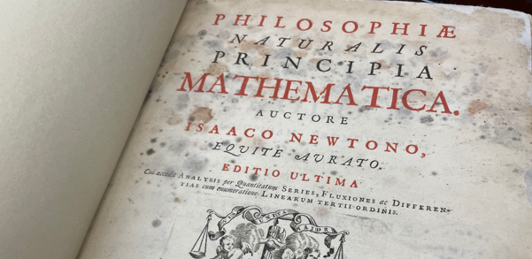

[Billet en cours de rédaction]{.smallcaps}

## *Principia Mathematica*, c'est quoi ?

*Philosophiæ Naturalis Principia Mathematica*^Q^ de Isaac Newton (1687) est une oeuvre majeure dans l'histoire des sciences. Tout ce que j'en sais avant de débuter ce projet c'est que les lois mathématiques qui y figurent servent à décrire le monde physique, principalement le mouvement des astres et la gravitation. De plus, je me souviens que Newton y développe sa propre méthode de calcul infinitésimal (dérivé+intégral) en concurrence avec Liebniz sur qui est le premier.

[{fig-alt="Page de garde des Principia Mathematica"}](https://umontreal.on.worldcat.org/oclc/869576311)

## Pratiques de citation

*Principia* est un objet littéraire et scientifique idéal pour étudier les pratiques de citation que l'on y trouve car 1) on peut observer comment Newton cite ceux qui l'on précédé et tenter d'expliquer pourquoi; et 2) cette oeuvre a été lue et étudiée par un très grand nombre de scientifiques dans les siècles qui ont suivi (impact).

Je me sers de cette étude descriptive comme exercice de méthodologie pour le décorticage d'une oeuvre littéraire et de ses pratiques de citation. Le but est de dégager des bonnes pratiques, des questions, des enjeux, des découvertes, etc.

## Méthode 1 : annotation manuelle

J'ai parcouru visuellement tout le livre pour repérer des indications d'attribution, de citations, de mentions, etc.

J'ai trouvé principalement :

-   Beaucoup de mentions de personnes (entités nommées d'individus) et un peu d'institutions ou de groupes. Ils ont été indexé au fil de l'eau dans Wikidata avec la propriété [acknowledged (P7137)](https://www.wikidata.org/wiki/Property:P7137) et avec le qualifiant [object named as (P1932)](https://www.wikidata.org/wiki/Property:P1932) pour décrire la ou les formes que le nom prend dans le texte.

-   Un peu de mentions de travaux. Ils ont été indexé au fil de l'eau dans Wikidata avec la propriété [cites work (P2860)](https://www.wikidata.org/wiki/Property:P2860) et avec le qualifiant [object named as (P1932)](https://www.wikidata.org/wiki/Property:P1932) pour décrire comment l'oeuvre est décrite dans le texte.

### Inconvénients

Si on veut calculer qui est cité et combien de fois et où, il faut extraire toutes ces mentions et créer un script qui les compte. Et encore, certains termes trop génériques risquent de générer des faux-positifs (exemple : *Conics*). Idéalement, il aurait fallu créer un fichier XML-TEI et le baliser.

### Avantages

Cela permet de parcourir tout le document et de découvrir progressivement des tendances et se faire une culture sur les éléments mentionnés. Parfois, le repérage d'un astronome a été un vrai défi pour repérer qui pouvait être tel ou tel personnage cité.

Par 9 fois, il m'a fallu créer de nouveaux éléments Wikidata pour des entités (personnes ou travaux) qui n'existaient pas encore dans Wikidata :

-   Legum Allegoriæ (Q138348789)
-   Valentinus Estancius (Q138341375)
-   Ponthæus (Q138341287)
-   Samuel Colepress (Q138334903)
-   Varin (Q138334135)
-   Institutionum astronomicarum (Q138332932)
-   Conics (Q138296602)
-   The two Books of Apollonius Pergaeus... (Q138296556)
-   Ephemerides novae motuum coelestium (Q138354676)

On découvre et on mémorise naturellement des tendances. Par exemple :

-   Les personnes sont souvent citées en série ;
-   Les personnes sont soient des observateurs, soient des théoriciens (math, physique, etc.) ;
-   Les personnes sont souvent citées au début ou à la fin pour leurs théories ;
-   Les italiques sont parfois utilisées pour les personnes et les oeuvres ;
-   Les noms des personnes sont très succincts, voire ne correspondent pas à la forme « canonique » de leur nom tels que nous les connaissons aujourd'hui : espaces dans le nom, double L ou simple L, nom latin ou nom vulgaire, parfois nommé d'une manièr et parfois d'une autre, etc. ;
-   Galilée, dont les *Principia* prolongent les travaux, n'est pas beaucoup cité ;
-   Il y a une section de citations bibliques ;

## Méthode 2 : traitement automatisé par IAg

### AstaLab AutoDiscovery

J'ai testé *AstaLab AutoDiscovery* (AA) qui est censé être un «générateur d'hypothèses». J'ai téléchargé le texte complet des Principia depuis WikiSource au format Plain Text. Je l'ai soumis à AA en demandant 10 hypothèses. Ce n'était pas fameux mais la seule hypothèse intéressante était celle concernant les entités nommées citées. Voici ce qu'il dit :

> The citations of historical scientific authorities (e.g., Kepler, Galileo, Euclid, Descartes) are not uniformly distributed but appear in distinct bursts, suggesting that Newton engages with specific intellectual lineages in concentrated thematic blocks rather than continuously. ([source](https://autodiscovery.allen.ai/runs/2b2c27fe-d02c-4f3e-9cc7-b8557a2cd781?exp=2))

De manière plus intéressante encore, AA fournit le code Python pour produire cette déclaration. Le voici :

``` python

import numpy as np
import matplotlib.pyplot as plt
import re
import os
from scipy.stats import kstest
from collections import Counter

# Define the target names of historical scientists
# Using a predefined list as suggested to avoid NER model dependency issues
target_names = [
    "Kepler", "Galileo", "Euclid", "Descartes", "Copernicus", 
    "Tycho", "Brahe", "Huygens", "Hooke", "Halley", "Boyle", 
    "Archimedes", "Apollonius", "Wren", "Wallis", "Leibniz", "Newton"
]

# File path setup
filename = "The_Mathematical_Principles_of_Natural_Philosophy_(1846).txt"
filepath = os.path.join("..", filename)

# Check if file exists in parent dir, otherwise check current dir
if not os.path.exists(filepath):
    filepath = filename
    if not os.path.exists(filepath):
        print(f"Error: File {filename} not found in .. or current directory.")
        exit(1)

print(f"Loading dataset from: {filepath}")

with open(filepath, 'r', encoding='utf-8', errors='ignore') as f:
    text = f.read()

# 1. Identify locations of names
print("Identifying name occurrences...")
# Use regex with word boundaries for robustness
pattern = r'\b(' + '|'.join(target_names) + r')\b'
matches = list(re.finditer(pattern, text, re.IGNORECASE))

occurrences = []
found_names = []

for match in matches:
    occurrences.append(match.start())
    # Normalize name to Title Case for counting
    found_names.append(match.group(1).title())

if not occurrences:
    print("No target names found in the text.")
    exit()

# Convert to numpy array
positions = np.array(occurrences)
total_length = len(text)

# 2. Time-series-like array (positions are the events)
# Normalize positions to [0, 1] for KS test against uniform distribution
normalized_positions = positions / total_length

# 3. Kolmogorov-Smirnov Test
# Test if the observed normalized positions follow a uniform distribution [0, 1]
stat, p_value = kstest(normalized_positions, 'uniform')

# 4. Dispersion Index of distances
# Calculate distances (inter-arrival times) between consecutive names
intervals = np.diff(positions)
if len(intervals) > 0:
    mean_interval = np.mean(intervals)
    var_interval = np.var(intervals, ddof=1)
    # The user requested variance/mean of the distances
    dispersion_metric = var_interval / mean_interval
    
    # Also calculating Coefficient of Variation (CV) which is dimensionless
    cv = np.std(intervals, ddof=1) / mean_interval
else:
    mean_interval = 0
    var_interval = 0
    dispersion_metric = 0
    cv = 0

# Generate Summary
counts = Counter(found_names)

print("\n##### Analysis Results #####")
print(f"Total Citations Found: {len(positions)}")
print(f"Unique Scientists Cited: {len(counts)}")
print("\nTop 10 Most Cited Scientists:")
for name, count in counts.most_common(10):
    print(f"  {name}: {count}")

print("\n##### Statistical Test Results #####")
print(f"KS Test Statistic: {stat:.4f}")
print(f"KS Test p-value: {p_value:.4e}")
if p_value < 0.05:
    print("Result: The distribution of names is significantly different from Uniform (p < 0.05).")
else:
    print("Result: The distribution is consistent with Uniform.")

print(f"\nMean Distance between citations: {mean_interval:.2f} characters")
print(f"Variance of Distances: {var_interval:.2f}")
print(f"Dispersion Metric (Var/Mean of distances): {dispersion_metric:.2f}")
print(f"Coefficient of Variation (Std/Mean): {cv:.2f}")
if cv > 1:
    print("Interpretation: CV > 1 suggests clustering/burstiness.")
elif cv < 1:
    print("Interpretation: CV < 1 suggests regularity.")
else:
    print("Interpretation: CV ~ 1 suggests random Poisson process.")

# Visualizations
plt.figure(figsize=(15, 6))

# Subplot 1: Rug Plot
plt.subplot(1, 2, 1)
plt.eventplot(positions, orientation='horizontal', colors='black', linewidths=0.5)
plt.title("Rug Plot of Scientific Authority Citations")
plt.xlabel("Position in Text (Characters)")
plt.yticks([])
plt.xlim(0, total_length)

# Subplot 2: Histogram
plt.subplot(1, 2, 2)
plt.hist(positions, bins=50, color='skyblue', edgecolor='black', alpha=0.7)
plt.title("Histogram of Citation Density")
plt.xlabel("Position in Text (Characters)")
plt.ylabel("Frequency")

plt.tight_layout()
plt.show()
```

Comme on peut le voir, il suffit de changer le contenu de la variable `target_names` avec tous les noms que l'on veut pour regénérer un nouveau résultat testant la présence d'entités nommées tout le long du texte.

### Extraire les noms de Wikidata

On va extraire tous les qualifiants de `acknowledges` avec :

``` sql

SELECT ?value ?valueLabel ?qualifierValue
WHERE {
  wd:Q205921 p:P7137 ?statement .
  ?statement ps:P7137 ?value .
  
  OPTIONAL {
    ?statement pq:P1932 ?qualifierValue .
  }
  
  SERVICE wikibase:label {
    bd:serviceParam wikibase:language "fr,en".
  }
}
```

[Essayez-la](https://query.wikidata.org/#SELECT%20%3Fvalue%20%3FvalueLabel%20%3FqualifierValue%0AWHERE%20%7B%0A%20%20wd%3AQ205921%20p%3AP7137%20%3Fstatement%20.%0A%20%20%3Fstatement%20ps%3AP7137%20%3Fvalue%20.%0A%20%20%0A%20%20OPTIONAL%20%7B%0A%20%20%20%20%3Fstatement%20pq%3AP1932%20%3FqualifierValue%20.%0A%20%20%7D%0A%20%20%0A%20%20SERVICE%20wikibase%3Alabel%20%7B%0A%20%20%20%20bd%3AserviceParam%20wikibase%3Alanguage%20%22fr%2Cen%22.%0A%20%20%7D%0A%7D)

Ensuite, on exporte le résultat au format tsv ou csv, on supprime les deux premières colonnes pour ne garder que la colonne `qualifierValue`. On fait un peu de ménage dedans :

-   sans `Mr.` ou `Dr.` ou `M.`
-   sans initiales, ni extensions du nom (`Pappus of Alexandria` devient `Pappus`)
-   supprimer les troncatures emboîtées pour éviter les doubles comptages (ex: pour `Samuel Colepress` et `Colepress` : ne garder que `Colepress`)

Cela donne [names.csv](names.csv)

### Code modifié

Remplacer la variable `target_names` plus haut par :

``` python

target_names = [
"Horrox", "Egyptians", "Romans", "Anaximander", "Pythagoreans", "Pompilius", "Democritus", "Eudoxus", "Calippus", "Crabtrie", "Marius", "Townley", "Romer", "Ricciolus", "Kircher", "Pappus", "Halley", "Royal Society", "Galileo", "Wren", "Wallis", "Huygens", "Huygenian", "Hugenius", "Mariotte", "Euclid", "Hook", "Hooke", "Apollonius", "Archimedes", "Snellius", "Des Cartes", "Grimaldus", "Collins", "Slusius", "Huddens", "Desaguliers", "Sauveur", "Copernicus", "Copernican", "Borelli", "Townly", "Cassini", "Pound", "Kepler", "Keplerian", "Bullialdus", "Ptolemy", "Vendelin", "Street", "Tycho", "Mercator", "Norwood", "Picart", "Richer", "Varin", "des Hayes", "Couplet", "Feuillé", "de la Hire", "Colepress", "Sturmy", "Machin", "Pemberton", "Flamsted", "Hevelius", "Cysatus", "Bayer", "Kirch", "Julius Cæsar", "Ponthæus", "Cellius", "Galletius", "Ango", "Storer", "Montenari", "Zimmerman", "Estancius", "Simeon", "Matthew Paris", "Aristotle", "Auzout", "Petit", "Gottignies", "Bradley", "Hipparchus", "Cornelius Gemma", "God", "Pocock", "John", "Moses", "Aaron", "Pythagoras", "Cicer.", "Thales", "Anaxagoros", "Virgil", "Aratus", "St. Paul", "David", "Solomon", "Job", "Jeremiah", "Pharaoh", "Philolaus", "Aristarchus", "Plato", "Leibnitz",
]
```

Voir le [code](https://pmartinolli.github.io/code/principia-mathematica/main.py) modifié et le [corpus](https://pmartinolli.github.io/code/principia-mathematica/corpus.txt) associé.

### Contrôle (manuel)

Avec un éditeur de texte comme Notepad++, utiliser quelques noms pour compter manuellement quelques entités nommées dans le corpus (Fonction Rechercher + Compter) et ainsi vérifier que le code fonctionne et compte bien les choses.

### Résultats

``` texinfo
##### Analysis Results #####
Total Named Entities Found: 591
Unique Named Entities Mentioned: 106

Top 10 Most Mentioned Named Entities:
  God: 65
  Halley: 32
  Kepler: 29
  Royal Society: 26
  Flamsted: 24
  Hevelius: 21
  Huygens: 20
  Hook: 19
  Leibnitz: 17
  Hooke: 16

##### Statistical Test Results #####
KS Test Statistic: 0.2893
KS Test p-value: 2.7514e-44
Result: The distribution of names is significantly different from Uniform (p < 0.05).

Mean Distance between Mentions: 2430.27 characters
Variance of Distances: 72255621.25
Dispersion Metric (Var/Mean of distances): 29731.51
Coefficient of Variation (Std/Mean): 3.50
Interpretation: CV > 1 suggests clustering/burstiness.
```


## Et maintenant ?

#### *Keyword in Context*

On pourrait créer un nouveau code pour générer un index avec tous les mots-clés cherchés en contexte (*Keyword in Context* ou *KWIC*) et ainsi comprendre comment ils sont utilisés dans le texte.

On peut y ajouter un graphique qui indique à quel endroit est-ce que les mots sont repérés.

Voici le [code](https://pmartinolli.github.io/code/principia-mathematica/kwic.py) et le [résultat](https://pmartinolli.github.io/code/principia-mathematica/kwic_index.html).

#### Pourquoi faire ça ?

1.  Pour agir comme **contrôle** du traitement du corpus et vérifier que tout à bien été repéré. En effet, certaines entités nommées peuvent avoir été oubliées lors du traitement manuel et. comme les entitées nommées sont souvent menrionnées à côté d'autres entités nommées, cela peut aider à repérer des manquants.
2.  Mieux **repérer les oeuvres citées**. En effet, dans l'immense majorité des cas, le titre d'une oeuvre est accompagnée de son auteur (avant ou après le titre).
3.  Pour comprendre comment les entités nommées sont **utilisées** :
    1.  on mentionne une personne pour ses idées (découvertes, équations, théories, etc.) ou pour ses observations astronomiques ?
    2.  En début ou en fin de corpus ?
    3.  Autres.

#### Autres pistes

On pourrait comparer les **différentes éditions** des *Principia* pour observer quelles sont entités nommées qui disparaissent, ou qui apparaissent. Et pourquoi ?

## Commentaires

En ne connaissant rien du sujet, on peut découvrir que Newton semble croire honnêtement en un **Dieu** créateur et ordonateur. En effet, Dieu est l'entité nommée la plus mentionnée (65x) et Newton n'utilise pas de formules toutes faites ou stéréotypées à son égard. Chaque mention est une insertion originale et argumentée dans le texte. De plus, Dieu est mentionné aux mêmes endroits du texte que la plupart des autres entités nommées (essentiellement des savants et des observateurs), c'est-à-dire au début et à la fin du texte. Dieu fait partie intégrante de l'écosystème discursif, au même titre que les savants et que les astronomes-observateurs.

Ensuite, **Edmond** **Halley** (32x) qui finança cette oeuvre et les travaux de Newton. Les *Principia* commencent par un prologue de deux pages de Halley. Je note que dans l'édition [WikiSource](#0) de la version américaine (1846), ces deux pages se sont transformées en un tout petit épigraphe (qui correspond à la dernière ligne du prologue écrit par Halley, bizarre).

> Nec fas est proprius mortali attingere Divos. — [Halley.]{.smallcaps}

**Robert Hooke** (16x), que parfois Newton orthographie « *Hook »* (19x), est aussi beaucoup mentionné. Les deux savants se [disputaient](https://www.themarginalian.org/2016/02/16/newton-standing-on-the-shoulders-of-giants/) sur l'originalité de découvertes mutuelles. Anecdotiquement il paraîtrait que, comme Hooke était petite taille, Newton aurait choisit cette fameuse expression dans une lettre :

> What Des-Cartes did was a good step. You have added much several ways, & especially in taking the colours of thin plates into philosophical consideration. If I have seen further it is by standing on the sholders of Giants. ([+](https://en.wikipedia.org/wiki/Standing_on_the_shoulders_of_giants))

Newton a construit sa mécanique céleste sur les travaux de **Johannes Kepler** (29x), un savant de la génération précédente, décédé 13 ans avant la naissance de Newton. **Johannes** **Hevelius** (21x), que Newton n'a pas connu non plus et qui décède l'année de publication des *Principia,* a été visité par Halley. Il est mentionné pour ses observations. **Huygens** (20x) rencontrera Newton deux ans après la publication des *Principia* en visitant Londres.

La **Royal Society** (26x), à laquelle Newton est membre, est mentionnée de nombreuse fois. Il en deviendra Président en 1703.

**John Flamsteed** (24x) fut mis sous pression par Newton pour livrer des données confidentielles sur les observations de la Lune pour les *Principia*. Plus tard, Newton publiera les données incomplètes et sans autorisation ce qui créera un [scandale](https://mathshistory.st-andrews.ac.uk/Extras/Flamsteed_Newton/).

**Leibniz** est mentionné (17x). Ils entreront dans un [conflit](https://en.wikipedia.org/wiki/Leibniz%E2%80%93Newton_calculus_controversy) célèbre après la publication des *Principia* pour savoir qui des deux a inventé le calcul infinitésimal.

## Plus de contexte!

Bien évidemment, cette analyse avec peu de connaissances préalables des *Principia* a besoin d'être contextualisée par la lecture de la conversation scientifique historique sur le sujet (l'historiographie).

On pourra bientôt lire le livre (fin 2026) [*The Winding Trail to Newton's Principia Mathematica*](https://press.princeton.edu/books/hardcover/9780691287782/the-winding-trail-to-newtons-principia-mathematica) de Jed Z. Buchwald et Mordechai Feingold. En attendant, on pourrait lire d'[autres travaux](https://scholar.google.fr/scholar?hl=en&as_sdt=0,5&inst=3940701053777478036&q=feingold+buchwald) sur le même sujet par ses deux auteurs.
