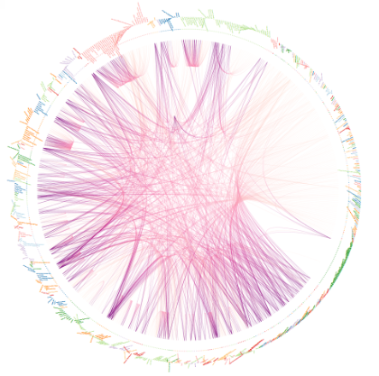
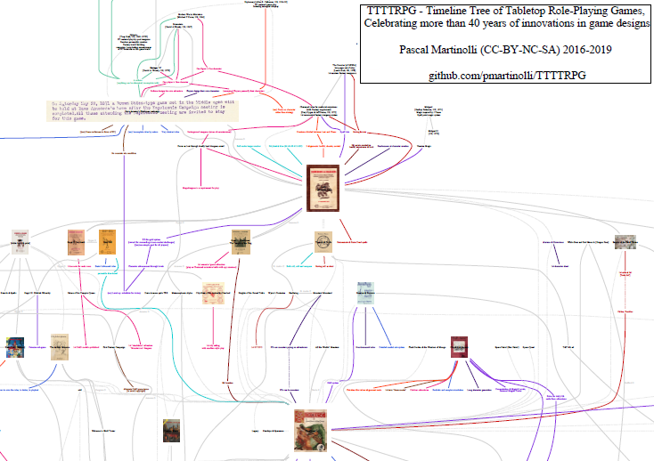
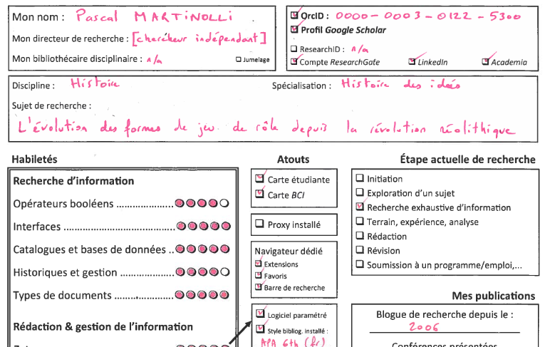

### On the Shoulders of Cloud Giants

{.float-end .ms-3 width="282"}This project explores how tabletop role-playing game works reference one another—through explicit citations, bibliographies, acknowledgements, thanks, tributes, and similar forms of intertextual connection.

-   [♥]{style="color:red"} Martinolli, Pascal. 2019-ongoing. « [On the Shoulders of Cloud Giants: citation practices in the tabletop role-playing game publishing industry](https://github.com/pmartinolli/OtSoCG) » : Combining Wikidata, SPARQL and R Studio to analyze the citation network of TTRPGs from 1974 to now.

    -   ———. 2024. With JavaScript on [ObservableHQ](https://observablehq.com/@pascaliensis/on-the-shoulders-of-cloud-giants).

    -   ———. 2024. « [TTRPG blog communities : Who cites who ?](https://observablehq.com/@pascaliensis/ttrpg-blog-communities-who-cites-who) ». JavaScript on ObservableHQ.

    -   A selection of blog posts :

        -   Epigraphs ([part 1](https://zotrpg.blogspot.com/2020/08/epigraphs-in-ttrpgs-12.html), [part 2](https://zotrpg.blogspot.com/2021/04/epigraphs-in-tabletop-role-playing.html), [part 3](https://zotrpg.blogspot.com/2022/05/working-with-literary-epigraphs-in.html))

        -   Wikidata \> SPARQL \> [R Studio](http://zotrpg.blogspot.com/2019/12/citations-practices-in-ttrpg-publishing.html)

        -   [Dataviz with JS and Observable](http://zotrpg.blogspot.com/2024/06/on-shoulders-of-cloud-giants-dataviz.html)

        -   [Building community](http://zotrpg.blogspot.com/2022/06/building-community-by-citing-each.html) by citing

        -   [On the shoulders …](https://jdr.hypotheses.org/504) (first post in 2018)

### TTTTRPG

This project seeks to map the evolution of game design throughout the history of published tabletop role-playing games.

-   Martinolli, Pascal. 2019. «  [TTTTRPG - Timeline Tree of Tabletop Role-Playing Games](https://github.com/pmartinolli/TTTTRPG) linking 1000 TTRPGs with 800 game design innovations from 1974 to 2020, with dot & Graphviz. Also in [JavaScript](https://observablehq.com/@pascaliensis/ttttrpg).

    -   ———. 2024. « [TTTTRPG - Timeline Tree of Tabletop Role-Playing Games with JavaScript Workflow](https://observablehq.com/@pascaliensis/ttttrpg)  ». ObservableHQ.

    -   ———. At [Zenodo](https://doi.org/10.5281/zenodo.3492118)

    -   ———. A sample with [ObservableHQ.](https://observablehq.com/@pascaliensis/ttttrpg).

    -   A selection of blog posts :

        -   [dot code structure](http://zotrpg.blogspot.com/2019/06/structure-of-source-code-for-tree-of.html)

        -   [Creating an Ontology of game designs](https://zotrpg.blogspot.com/2025/06/creating-ontology-of-role-playing-game.html) [part2](https://zotrpg.blogspot.com/2025/07/creating-anthology-of-game-design-2.html)

        -   [Phylomemetics](http://zotrpg.blogspot.com/2019/03/phylomemetics-of-boardgames-and.html) of boardgames and tabletop role-playing games

        -   Exhibition [Donjons & Données probantes](http://zotrpg.blogspot.com/2018/10/exhibition-donjons-donnees-probantes-in.html) in the Université de Montréal

        -   [Greg Stafford](http://zotrpg.blogspot.com/2018/10/greg-stafford-scholarly-obituary.html) (scholarly) obituary

[{fig-align="center" width="425"}](https://pmartinolli.github.io/assets/img/ttttrpg-snapshot.png)

### «academicTTRPG» Bibliography

This project aims to gather all academic and para-academic works related to tabletop role-playing games. It is curated by Pascal Martinolli and [Michael Freudenthal](https://michael-freudenthal.fr/).

-   A [Zotero](https://www.zotero.org/groups/446523) open access bibliography on scholarly studies of TTRPG (updated weekly) or [BibTeX](https://drive.google.com/file/d/0BwGfcq6CsQ6lUVVaVkdWSmZqVG8/view?usp=sharing&resourcekey=0-xGz9RZe2p6KQxOXy4EMVyQ) (updated yearly).

    -   [♥]{style="color:red"} As [one HTML portable and browsable file](https://pmartinolli.github.io/academicTTRPG) (11 Mo, updated March 2026)

    -   A [working paper (fr/en)](https://pmartinolli.github.io/JDR50bibliometrie/index-english.html) about it.

    -   Martinolli, Pascal. 2024. «  [*ZoteroJSnalysis* : Analyzing your Zotero library of references with Javascript](https://observablehq.com/@pascaliensis/zoterojsnalysis) ». ObservableHQ.

    -   Martinolli, Pascal. 2023. « [*ZoteroRnalysis*: analyze a Zotero library of references with R Studio & with reconciled data from Wikidata/OpenRefine](https://github.com/pmartinolli/ZoteroRnalysis) ». GitHub.

### Scholarly Character Sheet

This teaching aid is designed to enhance clarity, engagement, and self-reflection in a graduate seminar on library instruction.

-   [♥]{style="color:red"} Martinolli, Pascal. 2022. « [A Scholarly Character Sheet to Frame Learning Activities and Improve Engagement](https://journals.uu.se/IJRP/article/view/291) ». *International Journal of Role-Playing*, no 12 : 40-61. DOI : [10.33063/ijrp.vi12.291](https://journals.uu.se/IJRP/article/view/291). Explaining why and how to frame learning activities with a [TTRPG character sheet](https://github.com/pmartinolli/TM_SchoCharSheet).

    {width="480"}

-   Martinolli, Pascal. 2021. « [La feuille de personnage du jeune chercheur : une activité pédagogique ludifiée pour améliorer l’engagement](https://hal.science/hal-04627635) ». Dans *Journée d’étude « Donjons & Labo : les lieux du jeu », Université de Grenoble Alpes, UMR Litt&Arts*. Grenoble.

    -   [Document de présentation](http://hdl.handle.net/1866/25029)

    -   [Document pédagogique](https://github.com/pmartinolli/TM_SchoCharSheet)

-   Martinolli, Pascal. 2018. « [Quatre fiches pour ludifier les fondements du nouveau Référentiel de l’ACRL](http://hdl.handle.net/1866/20641) ». Dans *Congrès WILU 2018 « Information into Action »*. Ottawa.

-   Martinolli, Pascal. 2018. « [Jeu de rôle et formation aux compétences informationnelles : de la ludification à la jeuderôlisation](http://hdl.handle.net/1866/21088) ». Journée d’étude *Donjons & Données probantes*, Montréal : Université de Montréal.

-   Martinolli, Pascal. 2018. « [Six Gamified Activities to Engage the ACRL’s Framework Threshold Concepts](https://zotrpg.blogspot.com/2018/11/trpg-elements-to-enhance-student.html) ». Montréal : McGill U.

-   A selection of blog posts on TTRPG & education :

    -   TRPG Elements to [Engage Students](http://zotrpg.blogspot.com/2018/11/trpg-elements-to-enhance-student.html) in Information Literacy Workshops

    -   [Side-Quests & Character Sheets](http://zotrpg.blogspot.com/2018/06/side-quests-character-sheets-four.html)

    -   [Roleplayification](http://zotrpg.blogspot.com/2016/12/roleplayification-specific-kind-of.html)

### TTRPG Coding & Data Contributions

-   [♥]{style="color:red"} Martinolli, Pascal. 2025. « [TTRPG OWL. An anthology of game designs in tabletop role-playing games](https://pmartinolli.github.io/TTRPG_OWL/) ».

    -   Martinolli, Pascal. 2025. « [WebProtégé Ontology Formatter : RDF-OWL to HTML tree with individuals](https://github.com/pmartinolli/TTRPG_OWL) ». Python.

-   Martinolli, Pascal. 2024. « [Thesaurus builder CSV-\>PDF: Turning a two-levels thesaurus in CSV into a one-page PDF](https://github.com/pmartinolli/MyThesaurus) ». Python.

-   Martinolli, Pascal. 2024. «  [Python tools for web scraping, analyzing, and preserving tabletop role-playing games blogs](https://github.com/pmartinolli/pyTTRPGblogScraping) ». GitHub.

-   Martinolli, Pascal. 2020. « [TTGBG - Timeline Tree of Games and Board Games, Celebrating More Than 8000 Years of Game Design Innovations](https://github.com/pmartinolli/TTGBG) ». Dot.

-   Martinolli, Pascal. 2015-now [Wikidata](https://www.wikidata.org/wiki/User:Pmartinolli/OtSoCG) “gnoming” on TTRPG items & ontologies. [1M+](https://www.wikidata.org/wiki/Special:Contributions/Pmartinolli) contributions in 2025.

### Game Studies Papers

-   [♥]{style="color:red"} Martinolli, Pascal. 2024. « [Almost 50 Years of Academic Research on Tabletop Role-Playing Games: Historical Evolution and Bibliometric Analysis](https://pmartinolli.github.io/JDR50bibliometrie/index-english.html) ».

-   Martinolli, Pascal. 2024. « Évolution historique et analyse bibliométrique de la recherche académique sur le jeu de rôle sur table dans les publications universitaires ». Colloque : “Vous êtes dans une taverne…” Retour sur cinquante ans de jeux de rôle, 27-28 mars 2024, Metz. Université de Lorraine.

    -   [Papier de la présentation (en cours de révision pour publication dans des actes)](https://pmartinolli.github.io/JDR50bibliometrie/).

    -   [Diapositives](https://hal.science/hal-04575274).

    -   [Captation vidéo](https://ultv.univ-lorraine.fr/video/17578-50-ans-de-jeux-de-role-10-evolution-et-analyse-de-la-recherche-academique-sur-le-jeu-de-role-sur-table/).

### Billets de blogues en français

-   Martinolli, Pascal. 2016-now [*Hypothèses : Jeux de rôle sur table*](https://jdr.hypotheses.org/)*.* Blogue de recherche, carnet de veille & collection bibliographique sur le jeu de rôle sur table ».

-   Sélection de quelques billets :

    -   [L’*Enfer* de Dante](https://jdr.hypotheses.org/1476) dans les jeux de rôle

    -   [Faim, famine et cannibalisme](https://jdr.hypotheses.org/1544) dans les jeux de rôle sur table publiés

    -   Le JDR comme rituel d’[hospitalité et d’invitation](https://jdr.hypotheses.org/category/hospitalite).

    -   Et si… le JDR avait été [inventé avant 1971](https://jdr.hypotheses.org/477) ?

    -   [Les épigraphes](https://jdr.hypotheses.org/1332), [partie 2](https://jdr.hypotheses.org/1401), [partie 3](https://jdr.hypotheses.org/1661).

    -   [Esperluettes, assonances & allitérations](https://jdr.hypotheses.org/1012) : Figures de style du nom *Dungeons & Dragons*

    -   [Faire communauté](https://jdr.hypotheses.org/1771) en citant. [Pourquoi citer](https://jdr.hypotheses.org/878) ou ne pas citer ?

    -   [Créer une ontologie de *game designs*](https://jdr.hypotheses.org/2144). [Phylomémétique](https://jdr.hypotheses.org/901) des jeux ?

### Blog Posts in English

-   Martinolli, Pascal. 2016-now [*ZOtRPG !*](http://zotrpg.blogspot.com/) Blog about scholarly projects and academic references on tabletop role-playing games.

-   A selection of blog posts :

    -   [Dante’s Inferno in TTRPG](https://zotrpg.blogspot.com/2021/09/dantes-inferno-in-tabletop-role-playing.html)

    -   [Starvation, famine and cannibalism in tabletop role-playing games](http://zotrpg.blogspot.com/2021/11/starvation-famine-and-cannibalism-in.html)

    -   Tabletop role-playing games as [hospitality](http://zotrpg.blogspot.com/2018/04/tabletop-role-playing-games-as.html) and [hosting rituals](http://zotrpg.blogspot.com/2020/03/tabletop-role-playing-games-as.html)

    -   What if… TRPGs were created [before 1971](http://zotrpg.blogspot.com/2018/03/what-if-trpg-were-created-before-1971.html) ?

    -   Role-playing game groups as [hunter-gatherer bands](http://zotrpg.blogspot.com/2017/06/role-playing-game-groups-as-hunter.html); [Anthropology](http://zotrpg.blogspot.com/2017/04/anthropology-and-role-playing-games.html) & RPG

### Conferences & Activities

-   Martinolli, Pascal. 2022. « Curating tabletop role-playing game citation practices in Wikidata ». Dans *LD4 Wikidata Affinity Group*. WikiProject Linked Data for Production/Practical Wikidata for Librarians.

-   Savard, Sébastien (dir.) et Pascal Martinolli (conseiller), 2018. « [Exposition et journée d’étude *Donjons & Données probantes*](https://sites.google.com/view/donjonsdp) ».

-   Sauvé, Mathieu-Robert. 2018. « [Donjons, dragons et Wikipédia à la Bibliothèque des lettres et sciences humaines](https://web.archive.org/web/20181108070834/https://nouvelles.umontreal.ca/article/2018/10/30/donjons-dragons-et-wikipedia-a-la-bibliotheque-des-lettres-et-sciences-humaines/) ». *UdeMNouvelles*, 30 octobre 2018, sect. Forum.

-   Martinolli, Pascal et Sébastien Savard. 2018. Atelier Wikipédia pour la création de la page [Jeu de rôle sur table au Québec](https://fr.wikipedia.org/wiki/Jeu_de_r%C3%B4le_sur_table_au_Qu%C3%A9bec).

### Projets

-   Dresser un parallèle entre l'évolution culturelle des logicielles et celles des jeux de rôle sur table. Billet de blogue ?
-   Dessiner une carte des régions de France les plus citées dans les jeux de rôle.
-   Publier le code de *CitationesLudorum*, un ensemble de scripts Python pour traiter un corpus numérisé de jeux de rôle sur table.
